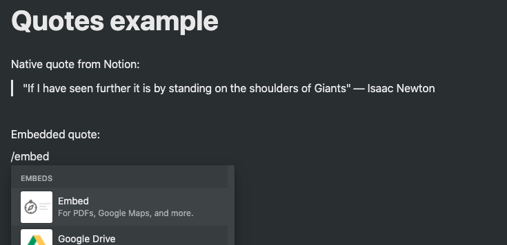
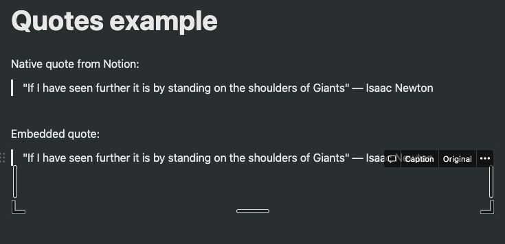
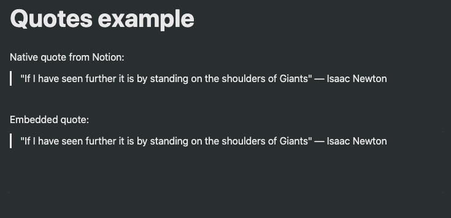

# quotes

Random quotes generator, built with GitHub's feature of VS Code Web.

I'm using this for a widget on my personal Notion.

If you would like to do the same, use the URL with an embedded block:

http://luanorlandi.github.io/quotes

You can also fork this repo. You will need to enable GitHub pages for the branch `main`.
